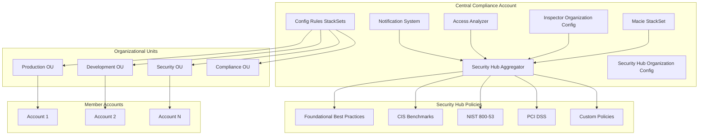

<!-- markdownlint-disable -->

<a href="https://www.appvia.io/"></a><br/><p align="right"> <a href="https://registry.terraform.io/modules/appvia/compliance/aws/latest"></a></a> <a href="https://github.com/appvia/terraform-aws-compliance/releases/latest"></a> <a href="https://appvia-community.slack.com/join/shared_invite/zt-1s7i7xy85-T155drryqU56emm09ojMVA#/shared-invite/email"></a> <a href="https://github.com/appvia/terraform-aws-compliance/graphs/contributors"></a>

<!-- markdownlint-restore -->
<!--
  ***** CAUTION: DO NOT EDIT ABOVE THIS LINE ******
-->


# Terraform AWS Compliance Module

## Overview

The Terraform AWS Compliance module provides a comprehensive, opinionated solution for implementing enterprise-grade security and compliance controls across AWS Organizations. This module orchestrates multiple AWS security services to create a unified compliance framework that ensures consistent security posture, automated monitoring, and regulatory adherence across all organizational units and accounts.

## Purpose & Intent

### **Problem Statement**

Large organizations face significant challenges in maintaining security and compliance across their AWS infrastructure:

- **Fragmented Security Posture**: Multiple accounts and organizational units often have inconsistent security configurations
- **Compliance Complexity**: Meeting regulatory requirements (SOC 2, PCI DSS, HIPAA, etc.) across distributed infrastructure
- **Manual Security Management**: Time-consuming and error-prone manual configuration of security services
- **Lack of Centralized Visibility**: Difficulty in monitoring security posture across the entire organization
- **Inconsistent Standards**: Different teams implementing security controls differently
- **Audit Preparation**: Complex and time-consuming compliance reporting and evidence collection

### **Solution**

This module provides a centralized, automated approach to security and compliance that:

- **Centralizes Security Management**: Implements Security Hub as the central security command center
- **Automates Compliance Monitoring**: Deploys AWS Config rules across organizational units via StackSets
- **Enables Continuous Monitoring**: Provides real-time security findings and compliance status
- **Standardizes Security Controls**: Applies consistent security policies across all accounts
- **Facilitates Audit Preparation**: Generates comprehensive compliance reports and evidence
- **Reduces Operational Overhead**: Automates security service configuration and management

## Key Features

### 🔒 **Comprehensive Security Services**

- **AWS Security Hub**: Centralized security findings aggregation and management
- **AWS Config**: Configuration compliance monitoring and drift detection
- **AWS Access Analyzer**: Unused access identification and IAM policy analysis
- **AWS Inspector**: Vulnerability assessment for EC2, ECR, and Lambda workloads
- **AWS Macie**: Sensitive data discovery and protection
- **AWS GuardDuty**: Threat detection and security monitoring

### 📊 **Advanced Compliance Management**

- **Multi-Standard Support**: CIS, NIST, PCI DSS, AWS Foundational Security Best Practices
- **Custom Security Policies**: Configurable security controls with custom parameters
- **Organizational Unit Targeting**: Granular policy application across OUs and accounts
- **Rule Group Management**: Organized configuration rules for different environments
- **Compliance Reporting**: Automated compliance status reporting and evidence collection

### 🔔 **Intelligent Notifications**

- **Multi-Channel Alerts**: Slack, Microsoft Teams, and email notifications
- **Severity-Based Filtering**: Configurable alert thresholds (CRITICAL, HIGH, MEDIUM, LOW)
- **Real-Time Monitoring**: EventBridge-driven instant security finding notifications
- **Customizable Templates**: Tailored notification formats for different audiences
- **Escalation Workflows**: Automated escalation based on finding severity

### 🏗️ **Enterprise Architecture**

- **StackSet Distribution**: Automated deployment across organizational units
- **Regional Flexibility**: Multi-region support with centralized management
- **Account Exclusion**: Granular control over which accounts receive specific policies
- **Resource Tagging**: Comprehensive tagging for governance and cost management
- **Dependency Management**: Proper resource dependencies and lifecycle management

### 🛡️ **Security & Governance**

- **Least Privilege Access**: Minimal IAM permissions for all operations
- **Encryption Support**: KMS integration for sensitive data protection
- **Audit Trail**: Comprehensive logging and monitoring capabilities
- **Policy Customization**: Fine-tuned security controls based on organizational needs
- **Compliance Mapping**: Direct mapping to regulatory frameworks and standards

### ⚙️ **Operational Excellence**

- **Terraform State Management**: Full Terraform state management for all resources
- **Resource Tagging**: Consistent tagging across all created resources
- **Output Management**: Comprehensive outputs for integration with other modules
- **Dependency Management**: Proper resource dependencies and lifecycle management
- **Rollback Capabilities**: Safe rollback mechanisms for policy changes

## Architecture

### **System Components**



### **Data Flow**

1. **Policy Definition**: Security policies are defined in the central compliance account
2. **StackSet Distribution**: Policies are distributed to organizational units via AWS StackSets
3. **Continuous Monitoring**: AWS Config and Security Hub continuously monitor compliance
4. **Finding Generation**: Security findings are generated and aggregated in Security Hub
5. **Notification Processing**: Findings are processed and sent via configured notification channels
6. **Compliance Reporting**: Automated reports are generated for audit and compliance purposes

### **Security Services Integration**

- **Security Hub**: Central aggregation point for all security findings
- **AWS Config**: Configuration compliance monitoring and drift detection
- **Access Analyzer**: IAM policy analysis and unused access identification
- **Inspector**: Vulnerability assessment across compute workloads
- **Macie**: Sensitive data discovery and classification
- **GuardDuty**: Threat detection and security monitoring

## Usage

### **Basic Usage - Foundational Security**

```hcl
module "compliance" {
  source = "appvia/compliance/aws"
  version = "0.1.0"

  region = "us-east-1"
  
  tags = {
    Environment = "production"
    ManagedBy   = "terraform"
    Purpose     = "compliance"
  }

  securityhub = {
    aggregator = {
      create            = true
      linking_mode      = "ALL_REGIONS"
      specified_regions = ["us-east-1", "us-west-2"]
    }

    configuration = {
      auto_enable           = true
      auto_enable_standards = "DEFAULT"
      organization_configuration = {
        configuration_type = "CENTRAL"
      }
    }

    policies = {
      "foundational-security" = {
        enable      = true
        description = "AWS Foundational Security Best Practices for all accounts"
        
        associations = [
          { organization_unit = "ou-1234567890" }
        ]

        policy = {
          standard_arns = ["aws_foundational_best_practices"]
          controls = {
            disabled = [
              "Account.1",  # Security contact details
              "CloudTrail.1" # CloudTrail enabled (handled by org trail)
            ]
          }
        }
      }
    }
  }
}
```

### **Advanced Usage - Multi-Standard Compliance**

```hcl
module "compliance" {
  source = "appvia/compliance/aws"
  version = "0.1.0"

  region = "us-east-1"
  
  tags = {
    Environment     = "production"
    ComplianceLevel = "high"
    ManagedBy       = "terraform"
  }

  # Access Analyzer Configuration
  access_analyzer = {
    enable_unused_analyzer = true
    unused_analyzer_name   = "enterprise-unused-access"
    unused_access_age      = 90
  }

  # Inspector Configuration
  inspector = {
    enable              = true
    account_id          = "123456789012"
    enable_ec2_scan     = true
    enable_ecr_scan     = true
    enable_lambda_scan  = true
    enable_lambda_code_scan = true
  }

  # Macie Configuration
  macie = {
    enable                = true
    frequency             = "FIFTEEN_MINUTES"
    organizational_units  = ["ou-1234567890", "ou-0987654321"]
    excluded_accounts     = ["111111111111"] # Sandbox accounts
    stackset_name         = "enterprise-macie-config"
  }

  # Config Rules
  config = {
    stackset_name_prefix = "enterprise-config-"
    
    rule_groups = {
      "production-security" = {
        description = "Production security rules for critical workloads"
        associations = ["ou-prod-1234567890"]
        enabled_regions = ["us-east-1", "us-west-2"]
        
        rules = {
          "required-tags" = {
            description = "Validate required resource tags"
            identifier  = "REQUIRED_TAGS"
            resource_types = [
              "AWS::EC2::Instance",
              "AWS::S3::Bucket",
              "AWS::RDS::DBInstance"
            ]
            inputParameters = {
              tag1Key = "Environment"
              tag2Key = "Owner"
              tag3Key = "CostCenter"
            }
            max_execution_frequency = "TwentyFour_Hours"
          }
          
          "s3-bucket-encryption" = {
            description = "Ensure S3 buckets have encryption enabled"
            identifier  = "S3_BUCKET_SERVER_SIDE_ENCRYPTION_ENABLED"
            resource_types = ["AWS::S3::Bucket"]
            max_execution_frequency = "TwentyFour_Hours"
          }
        }
      }
    }
  }

  # Security Hub Configuration
  securityhub = {
    aggregator = {
      create            = true
      linking_mode      = "SPECIFIED_REGIONS"
      specified_regions = ["us-east-1", "us-west-2", "eu-west-1"]
    }

    configuration = {
      auto_enable           = true
      auto_enable_standards = "DEFAULT"
      organization_configuration = {
        configuration_type = "CENTRAL"
      }
    }

    notifications = {
      enable                = true
      eventbridge_rule_name = "enterprise-security-findings"
      severities            = ["CRITICAL", "HIGH"]
      sns_topic_queue_name  = "enterprise-security-alerts"
    }

    policies = {
      "cis-benchmark" = {
        enable      = true
        description = "CIS AWS Foundations Benchmark v1.4.0"
        
        associations = [
          { organization_unit = "ou-1234567890" }
        ]

        policy = {
          standard_arns = ["cis_v140"]
          controls = {
            disabled = [
              "CIS.1.1",  # Disable specific controls as needed
              "CIS.1.2"
            ]
          }
        }
      }

      "nist-800-53" = {
        enable      = true
        description = "NIST 800-53 Rev 5 compliance framework"
        
        associations = [
          { organization_unit = "ou-compliance-0987654321" }
        ]

        policy = {
          standard_arns = ["nist_sp_800_53_rev5"]
          controls = {
            custom_parameter = [
              {
                security_control_id = "AC.1"
                parameter = {
                  name       = "maxAccessKeyAge"
                  value_type = "NUMBER"
                  enum = {
                    value = "90"
                  }
                }
              }
            ]
          }
        }
      }
    }
  }

  # Notification Configuration
  notifications = {
    slack = {
      webhook_url = "https://hooks.slack.com/services/YOUR/SLACK/WEBHOOK"
    }
    
    teams = {
      webhook_url = "https://outlook.office.com/webhook/YOUR/TEAMS/WEBHOOK"
    }
    
    email = {
      addresses = [
        "security-team@company.com",
        "compliance@company.com"
      ]
    }
  }
}
```

### **Use Cases**

#### **1. Enterprise Security Program**

```hcl
# For large enterprises with comprehensive security requirements
module "enterprise_compliance" {
  source = "appvia/compliance/aws"
  
  region = "us-east-1"
  
  securityhub = {
    aggregator = {
      create = true
      linking_mode = "ALL_REGIONS"
    }
    
    policies = {
      "enterprise-foundational" = {
        enable = true
        description = "Enterprise-wide foundational security controls"
        associations = [
          { organization_unit = "ou-all-accounts" }
        ]
        policy = {
          standard_arns = ["aws_foundational_best_practices"]
          controls = {
            disabled = [
              # Customize based on enterprise requirements
            ]
          }
        }
      }
    }
  }
  
  config = {
    rule_groups = {
      "enterprise-tagging" = {
        description = "Enterprise resource tagging standards"
        associations = ["ou-all-accounts"]
        rules = {
          "required-tags" = {
            description = "Validate enterprise tagging standards"
            identifier = "REQUIRED_TAGS"
            resource_types = ["AWS::EC2::Instance", "AWS::S3::Bucket"]
            inputParameters = {
              tag1Key = "Environment"
              tag2Key = "Owner"
              tag3Key = "CostCenter"
              tag4Key = "DataClassification"
            }
          }
        }
      }
    }
  }
  
  tags = {
    Environment = "production"
    BusinessUnit = "Security"
    Compliance = "required"
  }
}
```

#### **2. Compliance-Focused Setup**

```hcl
# For organizations with strict regulatory requirements
module "compliance_focused" {
  source = "appvia/compliance/aws"
  
  region = "us-east-1"
  
  # Enable all security services
  access_analyzer = {
    enable_unused_analyzer = true
    unused_access_age = 30  # Stricter than default
  }
  
  inspector = {
    enable = true
    enable_ec2_scan = true
    enable_ecr_scan = true
    enable_lambda_scan = true
  }
  
  macie = {
    enable = true
    frequency = "FIFTEEN_MINUTES"
    organizational_units = ["ou-sensitive-data"]
  }
  
  securityhub = {
    policies = {
      "pci-dss-compliance" = {
        enable = true
        description = "PCI DSS v3.2.1 compliance controls"
        associations = [
          { organization_unit = "ou-payment-systems" }
        ]
        policy = {
          standard_arns = ["pci_dss"]
        }
      }
    }
  }
  
  notifications = {
    email = {
      addresses = [
        "compliance@company.com",
        "audit@company.com",
        "security@company.com"
      ]
    }
  }
  
  tags = {
    Environment = "production"
    Compliance = "pci-dss"
    DataClassification = "confidential"
  }
}
```

#### **3. Development Environment**

```hcl
# For development and testing environments
module "dev_compliance" {
  source = "appvia/compliance/aws"
  
  region = "us-east-1"
  
  securityhub = {
    configuration = {
      auto_enable = false  # Manual enablement for dev
      auto_enable_standards = "NONE"
    }
    
    policies = {
      "dev-foundational" = {
        enable = true
        description = "Basic security controls for development"
        associations = [
          { organization_unit = "ou-development" }
        ]
        policy = {
          standard_arns = ["aws_foundational_best_practices"]
          controls = {
            disabled = [
              # Disable controls that are too restrictive for dev
              "EC2.10",  # VPC endpoints
              "RDS.5",   # Multi-AZ
              "RDS.6"    # Enhanced monitoring
            ]
          }
        }
      }
    }
  }
  
  config = {
    rule_groups = {
      "dev-tagging" = {
        description = "Basic tagging requirements for dev"
        associations = ["ou-development"]
        rules = {
          "required-tags" = {
            description = "Validate basic resource tags"
            identifier = "REQUIRED_TAGS"
            resource_types = ["AWS::EC2::Instance", "AWS::S3::Bucket"]
            inputParameters = {
              tag1Key = "Environment"
              tag2Key = "Owner"
            }
          }
        }
      }
    }
  }
  
  tags = {
    Environment = "development"
    Purpose = "compliance"
  }
}
```

## Monitoring & Troubleshooting

### **CloudWatch Logs and Metrics**

The module creates comprehensive monitoring capabilities:

```bash
# View Security Hub findings
aws securityhub get-findings --filters '{"ComplianceStatus": [{"Value": "FAILED", "Comparison": "EQUALS"}]}'

# Monitor Config compliance
aws config get-compliance-summary-by-config-rule

# Check Access Analyzer findings
aws accessanalyzer list-findings --analyzer-arn arn:aws:access-analyzer:region:account:analyzer/analyzer-name
```

### **Key Monitoring Metrics**

| Service | Metric | Description | Use Case |
|---------|--------|-------------|----------|
| Security Hub | `Findings` | Number of security findings | Monitor security posture |
| Config | `ComplianceByConfigRule` | Compliance status by rule | Track configuration compliance |
| Access Analyzer | `UnusedAccessFindings` | Unused access findings | Monitor IAM hygiene |
| Inspector | `VulnerabilityFindings` | Vulnerability findings | Track security vulnerabilities |

### **Common Issues & Solutions**

#### **1. StackSet Deployment Failures**

```
Error: StackSet deployment failed for organizational unit
```

**Solutions**:

- Verify organizational unit ARNs are correct
- Check StackSet execution role permissions
- Ensure target accounts have proper permissions
- Review CloudFormation stack events for specific errors

#### **2. Security Hub Policy Association Issues**

```
Error: Security Hub policy association failed
```

**Solutions**:

- Verify policy ID and target ID are correct
- Check Security Hub organization configuration
- Ensure proper IAM permissions for policy association
- Verify target accounts are part of the organization

#### **3. Notification Delivery Issues**

```
Error: Notifications not being delivered
```

**Solutions**:

- Verify webhook URLs are correct and accessible
- Check EventBridge rule configuration
- Ensure SNS topic permissions are correct
- Verify Lambda function execution permissions

### **Operational Best Practices**

1. **Regular Compliance Reviews**: Schedule monthly compliance posture reviews
2. **Policy Updates**: Keep security policies updated with latest standards
3. **Exception Management**: Implement proper exception handling for disabled controls
4. **Training and Awareness**: Provide training on compliance requirements
5. **Incident Response**: Establish procedures for handling security findings

## Requirements

### **Prerequisites**

- AWS Organizations enabled
- Appropriate IAM permissions for Security Hub, Config, and StackSets
- Organizational units properly configured
- Notification channels (Slack, Teams, email) configured

### **AWS Services Used**

- AWS Security Hub
- AWS Config
- AWS Access Analyzer
- AWS Inspector
- AWS Macie
- AWS GuardDuty (via separate module)
- AWS StackSets
- AWS EventBridge
- Amazon SNS

### **Permissions Required**

- Security Hub organization administrator
- Config organization administrator
- StackSets administrator
- IAM permissions for service configuration
- CloudFormation permissions for StackSet templates

## Update Documentation

The `terraform-docs` utility is used to generate this README. Follow the below steps to update:

1. Make changes to the `.terraform-docs.yml` file
2. Fetch the `terraform-docs` binary (<https://terraform-docs.io/user-guide/installation/>)
3. Run `terraform-docs markdown table --output-file ${PWD}/README.md --output-mode inject .`

<!-- BEGIN_TF_DOCS -->
## Providers

| Name | Version |
|------|---------|
| <a name="provider_aws"></a> [aws](#provider\_aws) | >= 5.0.0 |

## Inputs

| Name | Description | Type | Default | Required |
|------|-------------|------|---------|:--------:|
| <a name="input_region"></a> [region](#input\_region) | The region to deploy the resources | `string` | n/a | yes |
| <a name="input_tags"></a> [tags](#input\_tags) | A map of tags to add to the resources | `map(string)` | n/a | yes |
| <a name="input_access_analyzer"></a> [access\_analyzer](#input\_access\_analyzer) | Configuration for the AWS Access Analyzer service | <pre>object({<br/>    enable_unused_analyzer = optional(bool, true)<br/>    # Indicates whether to enable the unused AWS Access Analyzer service<br/>    unused_analyzer_name = optional(string, "lza-unused-access-analyzer")<br/>    # The name of the unused AWS Access Analyzer service<br/>    unused_access_age = optional(number, 90)<br/>  })</pre> | `null` | no |
| <a name="input_config"></a> [config](#input\_config) | Configuration for the securityhub organization managed rules | <pre>object({<br/>    stackset_name_prefix = optional(string, "lza-config-")<br/><br/>    # The prefix added to the stacksets<br/>    rule_groups = optional(map(object({<br/>      associations = list(string)<br/>      # List of organizational units to deploy the managed rules<br/>      description = string<br/>      # Description for the rule group<br/>      enabled_regions = optional(list(string), null)<br/>      # List of regions to enable these rules<br/>      exclude_accounts = optional(list(string), null)<br/>      # The list of accounts to exclude from the organization managed rule<br/>      rules = map(object({<br/>        description = string<br/>        # The description of the organization managed rules<br/>        identifier = string<br/>        # The identifier of the organization managed rule<br/>        inputs = optional(map(string), {})<br/>        # The identifier of the organization managed rule scope<br/>        resource_types = list(string)<br/>        # The list of resource types to scope the organization managed rule<br/>        max_execution_frequency = optional(string, null)<br/>        # The max_execution_frequency of the rule<br/>      }))<br/>    })), {})<br/>    # The configuration for the securityhub organization managed rules<br/>  })</pre> | <pre>{<br/>  "rule_groups": {}<br/>}</pre> | no |
| <a name="input_config_retention_in_days"></a> [config\_retention\_in\_days](#input\_config\_retention\_in\_days) | The number of days to store config historical data (defaults to one year) | `number` | `2557` | no |
| <a name="input_inspector"></a> [inspector](#input\_inspector) | Organizational configuration for the AWS Inspector service | <pre>object({<br/>    account_id = optional(string, null)<br/>    # The delegated administrator account ID for the AWS Inspector service<br/>    enable = optional(bool, false)<br/>    # Indicates whether to enable the AWS Inspector service<br/>    enable_ec2_scan = optional(bool, false)<br/>    # Indicates whether to enable the AWS Inspector service for EC2 instances<br/>    enable_ecr_scan = optional(bool, false)<br/>    # Indicates whether to enable the AWS Inspector service for ECR repositories<br/>    enable_lambda_scan = optional(bool, false)<br/>    # Indicates whether to enable the AWS Inspector service for Lambda functions<br/>    enable_lambda_code_scan = optional(bool, false)<br/>    # Indicates whether to enable the AWS Inspector service for Lambda code<br/>  })</pre> | <pre>{<br/>  "enable": false<br/>}</pre> | no |
| <a name="input_macie"></a> [macie](#input\_macie) | Configuration for the AWS Macie service | <pre>object({<br/>    enable = optional(bool, false)<br/>    # Indicates whether to enable the AWS Macie service should be enabled in all accounts<br/>    excluded_accounts = optional(list(string), null)<br/>    # The list of accounts to exclude from the AWS Macie service<br/>    frequency = optional(string, "FIFTEEN_MINUTES")<br/>    # The frequency at which the AWS Macie service should be enabled<br/>    organizational_units = optional(list(string), null)<br/>    # The list of member accounts to associate with the AWS Macie service<br/>    stackset_name = optional(string, "lza-macie-configuration")<br/>  })</pre> | `null` | no |
| <a name="input_notifications"></a> [notifications](#input\_notifications) | Configuration for the notifications | <pre>object({<br/>    email = optional(object({<br/>      addresses = optional(list(string), [])<br/>    }), null)<br/>    slack = optional(object({<br/>      lamdba_name = optional(string, "lz-securityhub-all-notifications-slack")<br/>      webhook_url = string<br/>    }), null)<br/>    teams = optional(object({<br/>      lamdba_name = optional(string, "lz-securityhub-all-notifications-teams")<br/>      webhook_url = string<br/>    }), null)<br/>  })</pre> | <pre>{<br/>  "email": {<br/>    "addresses": []<br/>  },<br/>  "slack": null,<br/>  "teams": null<br/>}</pre> | no |
| <a name="input_securityhub"></a> [securityhub](#input\_securityhub) | Configuration for the securityhub | <pre>object({<br/>    aggregator = optional(object({<br/>      create = optional(bool, false)<br/>      # Indicates whether to create the securityhub<br/>      # Indicates whether to create the aggregator<br/>      linking_mode = optional(string, "ALL_REGIONS")<br/>      # Indicates whether to aggregate findings from all of the available regions<br/>      specified_regions = optional(list(string), null)<br/>      # A list of regions to aggregate findings from when using SPECIFIED_REGIONS linking mode<br/>      }), {<br/>      create            = false<br/>      linking_mode      = "ALL_REGIONS"<br/>      specified_regions = null<br/>      }<br/>    )<br/>    # The configuration for the aggregator<br/>    configuration = optional(object({<br/>      auto_enable = optional(bool, true)<br/>      # Indicates whether to automatically enable Security Hub<br/>      auto_enable_standards = optional(string, "DEFAULT")<br/>      # Indicates whether to automatically enable new controls and standards<br/>      organization_configuration = object({<br/>        configuration_type = optional(string, "CENTRAL")<br/>        # Indicates whether to enable Security Hub as a standalone service or as an organization master<br/>      })<br/>      # The configuration for the organization<br/>      }), {<br/>      auto_enable           = false<br/>      auto_enable_standards = "DEFAULT"<br/>      organization_configuration = {<br/>        configuration_type = "CENTRAL"<br/>      }<br/>    })<br/>    # The configuration for the securityhub<br/>    notifications = optional(object({<br/>      enable = optional(bool, false)<br/>      # Indicates whether to enable the securityhub notifications<br/>      eventbridge_rule_name = optional(string, "lza-securityhub-all-notifications")<br/>      # The name of the event bridge rule<br/>      severities = optional(list(string), ["CRITICAL", "HIGH"])<br/>      # The list of severities to enable the notifications<br/>      sns_topic_queue_name = optional(string, "lza-securityhub-all-notifications")<br/>      # Name of the SNS topic to send the notifications<br/>      }), {<br/>      enable                = false<br/>      eventbridge_rule_name = "lza-securityhub-all-notifications"<br/>      severities            = []<br/>      sns_topic_queue_name  = "lza-securityhub-all-notifications"<br/>    })<br/>    # The configuration for the notifications<br/>    policies = optional(map(object({<br/>      enable = optional(bool, true)<br/>      # Indicates whether the configuration policy is enabled<br/>      description = string<br/>      # The description of the configuration policy<br/>      associations = optional(list(object({<br/>        account_id = optional(string, null)<br/>        # The account ID to associate with the policy<br/>        organization_unit = optional(string, null)<br/>        # The organization unit to associate with the policy<br/>      })), [])<br/>      # The list of associations for the configuration policy<br/>      policy = object({<br/>        enable = optional(bool, true)<br/>        # Indicates whether the configuration policy is enabled<br/>        standard_arns = list(string)<br/>        # The ARNs of the standards to enable<br/>        controls = object({<br/>          disabled = optional(list(string), null)<br/>          # The list of control identifiers to disable<br/>          custom_parameter = optional(list(object({<br/>            security_control_id = string<br/>            # The ID of the security control<br/>            parameter = object({<br/>              name = string<br/>              # The name of the parameter<br/>              value_type = string<br/>              # The type of the parameter<br/>              enum = optional(object({<br/>                value = string<br/>                # The value of the parameter (if the type is ENUM)<br/>              }), null)<br/>            })<br/>            # The parameter for the security control<br/>          })), null)<br/>        })<br/>        # The parameter for the security control<br/>      })<br/>      # The configuration policy<br/>    })), {})<br/>  })</pre> | <pre>{<br/>  "aggregator": {<br/>    "create": false,<br/>    "linking_mode": "ALL_REGIONS",<br/>    "specified_regions": null<br/>  },<br/>  "configuration": {<br/>    "auto_enable": false,<br/>    "auto_enable_standards": "NONE",<br/>    "organization_configuration": {<br/>      "configuration_type": "CENTRAL"<br/>    }<br/>  },<br/>  "policies": {}<br/>}</pre> | no |

## Outputs

| Name | Description |
|------|-------------|
| <a name="output_inspector_resource_types"></a> [inspector\_resource\_types](#output\_inspector\_resource\_types) | A list of resources type to enable for inspector |
| <a name="output_securityhub_policy_associations"></a> [securityhub\_policy\_associations](#output\_securityhub\_policy\_associations) | A map of policy associations by policy name |
| <a name="output_securityhub_policy_configurations"></a> [securityhub\_policy\_configurations](#output\_securityhub\_policy\_configurations) | A map of all the policies to the central configuration arns |
<!-- END_TF_DOCS -->
